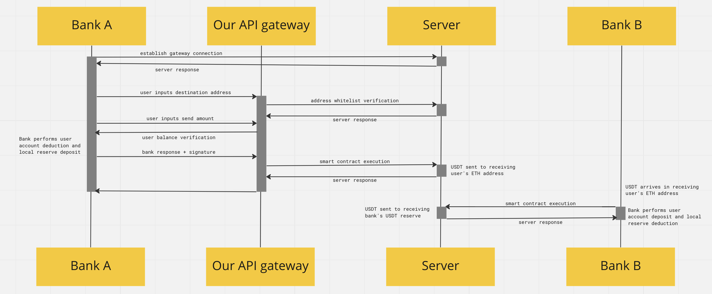

# Xyfer Gateway

Welcome to our Xyfer gateway API prototype. We aim to permeate the finance industry by revolutionizing the way banks perform **overseas transfers**. Our API aims to reduce infrastructure costs, consumer transaction overhead, and also improve the speed at which these transactions happen. On top of that, we hope that we can uphold a consistent and scalable service with the use of the blockchain and through a decentralized network of adopting banks. 

The source code within this repository contains a simulation user experience for a _**bank user**_ if banks were to adopt our API. The idea is to keep the touchpoints as minimal as possible, whilst executing an almost instantaneous transaction which can be verified on the blockchain. 

## Testing the prototype
---

To play around with our prototype, follow the steps below to set up your executing environment.

1. Ensure that you have NodeJS and npm installed. Follow the [link](https://nodejs.org/en/download/) for more instructions.

2. Download the source code into your local directory.

3. Using your terminal, navigate your current working directory to the root of the xyfer folder.

4. Run `npm init`

5. Run `npm install express cors body-parser nodemon`

6. Run `npm i ethers`

7. Run `npm install mongodb`

8. Run `npm install dotenv --save`, .env file details can be obtained from the team

9. Run `npm install ethereumjs-tx`

10. Run `npm install --save-dev @openzeppelin/contracts`

11. Run `npm install solc`

12. Run `npm install web3`

13. Run `node address.js`

14. Pop the login.html file path into your browser, and play around for a simulated experience. 

_Disclaimers:_ 
1. _The prototype is still a work-in-progress and you may encounter some errors or unexpected behavior._
2. _We employ MongoDB DBMS for our backend database and this requires IP whitelisting on your local host to connect. Thus, self-simulation is temporarily unavailable until we deploy our solution onto a cloud server. To view the experience, do check out our simulated demo video on our project homepage._ 
3. _You can install all packages at once using npm. We broke it up into steps to allow an entire overview of the packages required._

## Final Solution
---

Our final solution prioritizes two stakeholders within the industry. 

1. Banks
2. Consumers that procure bank services

### **Banks:**

The banks will connect to our API endpoints which functions as a **redirect gateway** where the magic of the overseas transfer happens. The banks are also required to have **USDT** and **Native Currency** reserves which must be maintained once every fixed time period.

Banks are required to use **Know Your Customer (KYC)** protocols in order to generate and whitelist their consumers Ethereum addresses. These Ethereum addresses are entirely controlled by us, and are by no means directly accessible to consumers except being used as a proxy wallet during the transfer of overseas funds.

The main mode of transfer would be through **ERC20 stablecoins** like USDT. This is to provide **price stability** and **lower risks** to the ecosystem. However, our implementation employs the use of our own token Xyfer (XFR) since we deployed our prototype on the Goerli Testnet. 

When a consumer makes an overseas transfer, their funds will be deposited into the bank's native currency reserves which triggers a smart contract to immediately facilitate a transfer from the bank's USDT reserves to the recipient's wallet address. 

The USDT will sit in the recipient's proxy wallet which can be transferred between wallets by the recipient by interacting with their own bank's curency reserves. For now, we are simulating the execution of a second smart contract that converts the recipient's USDT into their own native currency. This process is almost instant, regardless of distance.

Each new consumer sign up will generate an entirely new Ethereum address, which can be viewed on the block explorer. 

All that is left for the bank to do is maintain their reserves.

### **Consumers:**

The only thing that consumers have to do is to obtain the respective Ethereum wallet address from their recipient and hit send. That's it. 

## Tech Stack
---

Our prototype tech stack consists of HTML, CSS, JavaScript and Bootstrap for the client-side, and NodeJS, MongoDB, and the relevant JavaScript libraries for the server-side. 

Given more time and research, we would be transitioning our tech stack into using more robust frameworks like React, as well as incorporating secure databases and authentication systems. We would also fully build out our API endpoints for simple bank integration. 

More importantly, we would fully utilise smart contracts in order to simulate the user experience of a _**bank**_ incorporating our API and stay true to our proposed flow of communication between entities as shown below:

We are highly confident in the technology of smart contracts and blockchain to disrupt existing overseas transfers. 
